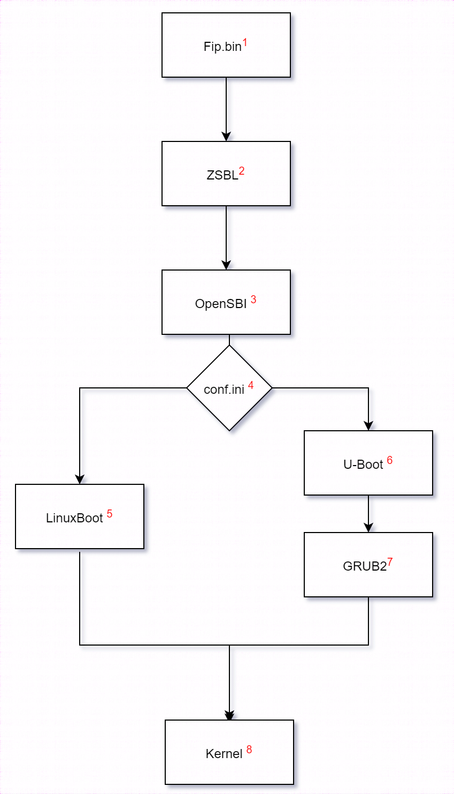

# SG2042 Boot Flow

1.  Fip.bin
2.  ZSBL (Zero Stage Bootloader): Code in the ROM of the board to
    initial DDR, CPU and Ethernet. Then load OpneSBI and U-Boot.
3.  OpenSBI (RISC-V Open Source Supervisor Binary Interface): The goal
    of the OpenSBI project is to provide an open-source reference
    implementation of the RISC-V SBI specifications for
    platform-specific firmwares executing in M-mode. An OpenSBI
    implementation can be easily extended by RISC-V platform and
    system-on-chip vendors to fit a particular hardware configuration.
4.  conf.ini: configuration file used to choose next bootloader.
5.  LinuxBoot: LinuxBoot is a firmware for modern servers that replaces
    specific firmware functionality like the UEFI DXE phase with a Linux
    kernel and runtime.
6.  U-Boot (Universal Bootloader): Its primary role is to facilitate the
    booting process of the embedded device.
7.  GRUB2 (GRand Unified Bootloader version 2): It is responsible for
    loading and transferring control to an operating system kernel
    software (such as Linux or GNU Mach). The kernel, in turn,
    initializes the rest of the operating system (e.g. a GNU system).
8.  Kernel
